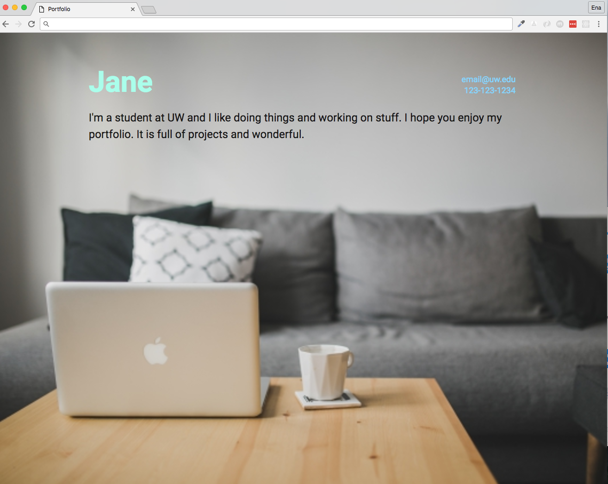
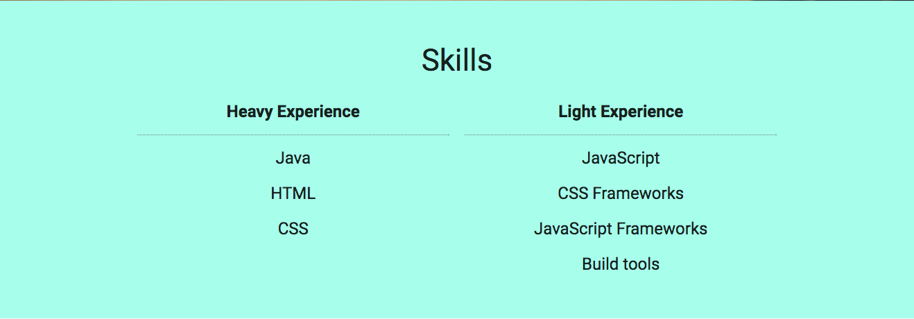
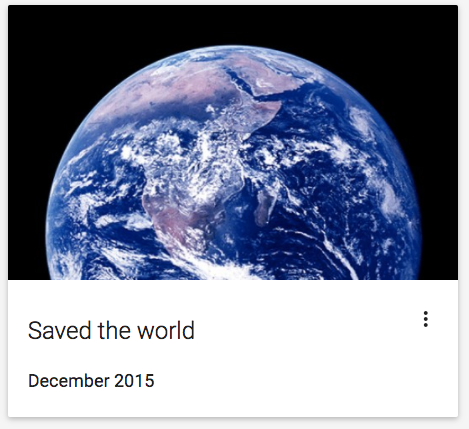
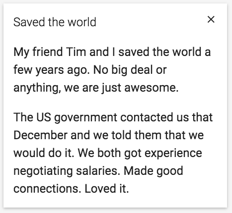

# Make your portfolio with [Materialize](http://materializecss.com/)

Portfolios are a good way to showcase all the cool projects you've worked on.

This is the one I came up with. Try to match this style as close as possible but fill it in with your own information, images, and colors.

## Required Information
* Introduction
  * Your name
  * A little bit about yourself and/or your interests
  * Contact information
* Skills
  * Hard or soft skills. Must include at least 4.
* Projects
  * 4 to 6 projects. They can be real or made up.
  * Each project must include...
    * Name
    * Description
    * When you did it
    * Relevant picture
    * What class/event/job/etc it was for

### Introduction Section

* The intro section takes up 100% of the browser height.
* It is a background image.

### Skills section

* The line under Heavy Experience and Light Experience is dotted

### Projects section

The cards are expandable. To expand, click the '...' and the section that appears should have the project description and what event/class/job/etc it was done for.

* Default state

* Expanded state

