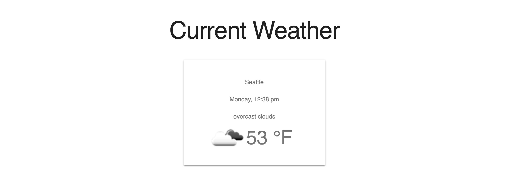

#React Challenge

## Set up your dev environment
Follow [these](https://github.com/info343-a16/info343-in-class) instructions.

###Weather App
In today's section we will be building a simple weather web application with react. This app will get and display the current weather for a city using data from [OpenWeatherMap](http://openweathermap.org/). You will have to make an account and register for an API key to use this service.

You do not have to match my design although you can if you want. Since labs are short, I included my html in `src/example.html` to save y'all some time. The css file is already included as well.

For example of how we have been viewing react, look in the 'react', 'react-ajax', 'react-data' and 'react-modules' folders in your in-class-coding repository.

Starter files will be available and will inlude more specific instuctions & tips.

###Starting development
Pop open your terminal and navigate to 'lab/react/'. After that follow these commands:

```bash
$ npm install
$ npm start
```

The first will download all the dependencies mentioned in the 'package.json' file. Then 'npm start' will fire up our web server and webpack. 
After that, go to 'http://localhost:3000' in your browser.

####Part 1: Get and display data
For this part you will be getting weather data from OpenWeatherMap for Seattle and then display it on the page.


####Part 2: Make it stateful w/ Fahrenheit/Celsius
Allow users to switch the temperature from Fahrenheit to Celsius and vice versa.


####Part 3: Look up weather of a city by name.
Include an input on your page to allow users to look up any city by name. OpenWeatherMap is pretty relaxed with its errors, so even if you type in a city that does not exists (ex. shjhflhaksjh) it might still return a result. You should include error handling for response statuses that are not "ok".


